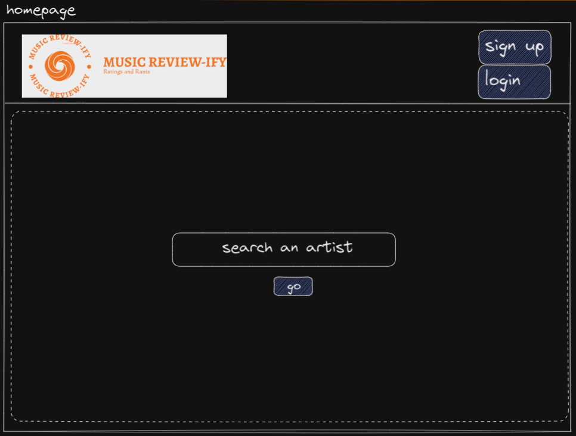
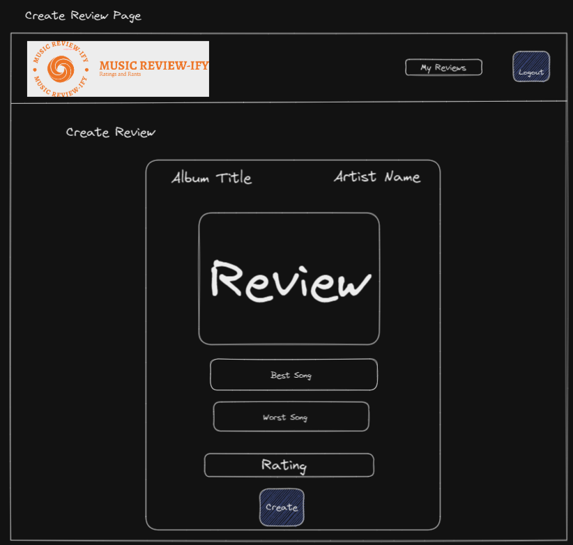
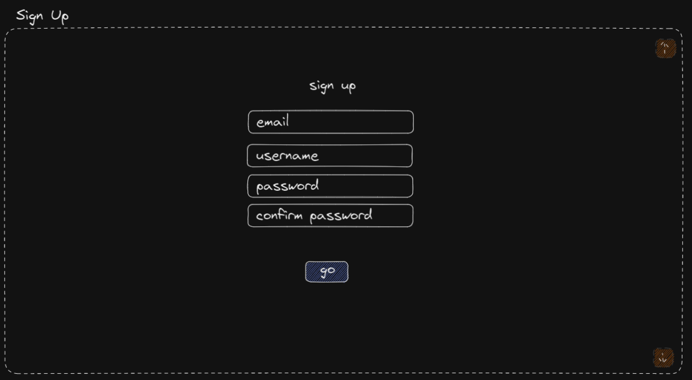
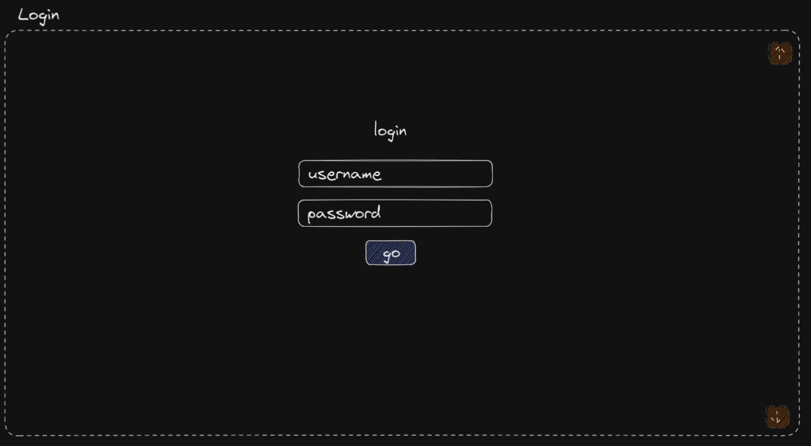
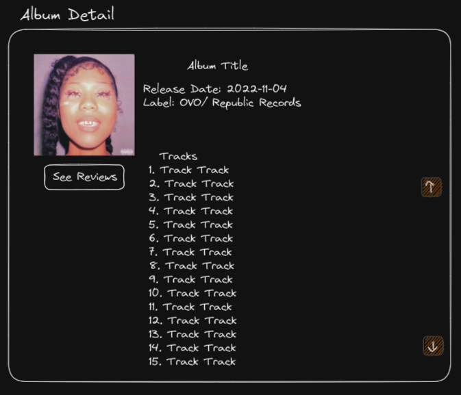

# Customer Graphical Human Interface

## Home Page

This will be the first page visitors arrive to on the website.
There will be links to a sign up modal, a login modal, and a search bar to search for an artist.

## Create A Review

This page will be where a logged in user will create a review of an album - required data will be the review title, rating, content, and optionally a best or worst song.

## Create An Account

This will be a modal where a visitor will create a new account they can when logging into the website - required data will be their username, email address, password, and their password again to confirm they both match.

## Login

This will be a modal where a visitor will log in to the website using their username and password - required data will be their username and password. Logging in to the website will allow users to create reviews.

## Search Results

This will populate the main page with albums made by the artist the user searched for. Users will be able to click on the album to view album details.

## Album Details

This will be a modal where a user can view the album details after searching for an artist. Album details will include the artist, album title, release date, tracks, and album cover.

